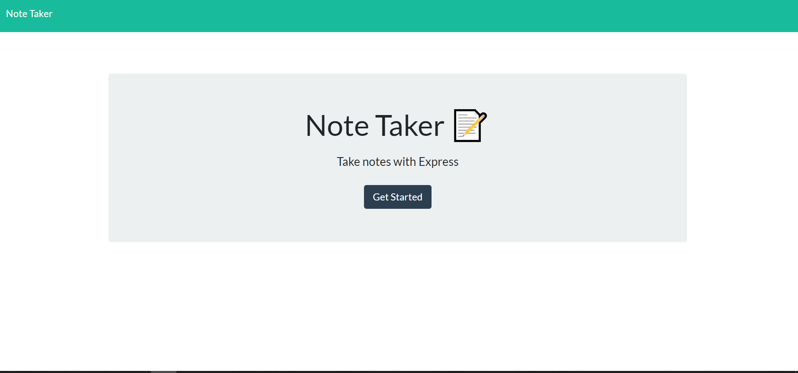
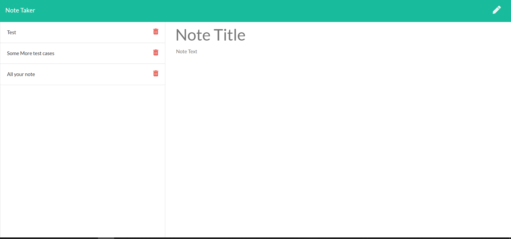

# noteTaker

A web based note keeping platform, capable of storing notes to refer to later. The notes are stored in a JSON file, pulled out to render page. The json is updated when a new note is saved or an old note is deleted. Select an old note to view its contents.   

# Deployed
https://protected-anchorage-69781.herokuapp.com/

